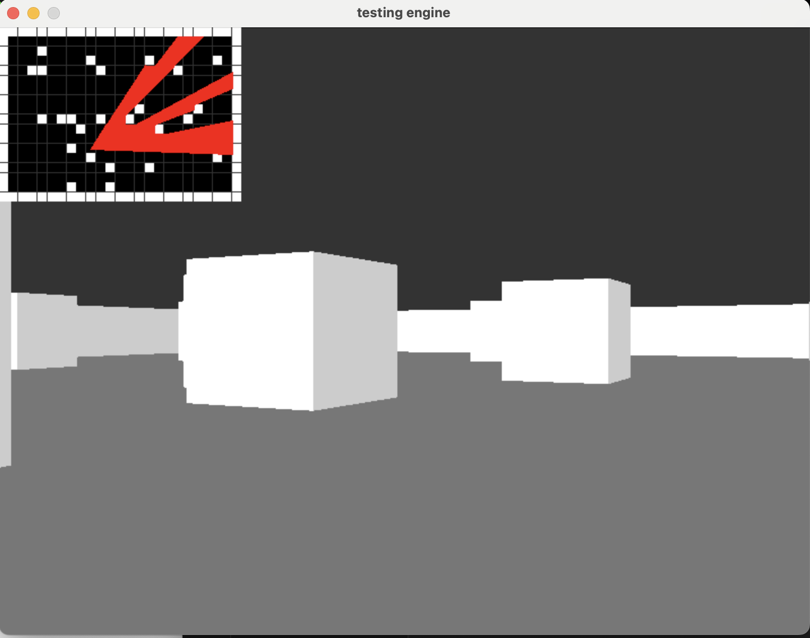

# Raycasting Engine in C with SDL

## Preview

Here's a preview of the raycasting engine in action:



This is a simple raycasting engine written in C using the SDL2 library. The engine simulates a first-person perspective, where the player can navigate through a 2D map and see walls and environments rendered in 3D. The implementation is based on raycasting principles, commonly used in early 3D games like *Wolfenstein 3D*.

## Features

- **Raycasting for 3D Rendering**: The engine projects 2D walls into a 3D environment using raycasting, simulating a first-person view.
- **Player Movement**: The player can move around the map and rotate their view, which updates the 3D projection dynamically.
- **Map Rendering**: The game world is represented as a grid of tiles, with walls and open spaces.
- **Weapon Rendering**: The engine can render a weapon image (PNG/JPG) in the player’s point of view.
- **Optimized Frame Rate**: The engine uses a frame timing mechanism to ensure smooth gameplay.
- **Cross-Platform**: Built using SDL2, making it portable to various platforms with minimal changes.

## Getting Started

### Prerequisites

To build and run the engine, you will need:

- **C compiler** (GCC, Clang, etc.)
- **SDL2**: Simple DirectMedia Layer (SDL2) for window management and graphics rendering.

### Installing Dependencies (on Linux)

1. Install SDL2:

```bash
sudo apt-get install libsdl2-dev
```

2. Install SDL_image:

```bash
sudo apt-get install libsdl2-image-dev
```

### Building the Engine

1. Clone the repository or copy the code to your local machine.
2. Run bash script.

```bash
./run.sh
```

### Usage

- Use arrow keys to move the player.
- Press `ESC` to exit the game.
